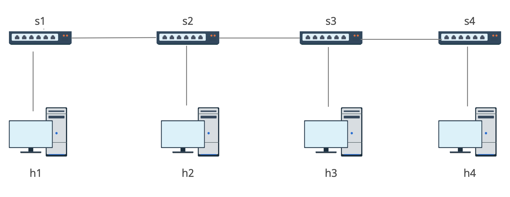

# Morphing Network Slicing #
Authors: Ascari Giacomo, Gatti Matteo, Lechthaler Pietro

## Short Introduction ##
In this project the goal is to show how a topology can be dynamically changed using a RYU SND controller.

This repository contains the following folders:
1. [/ryu-controller-solution](./ryu-controller-solution): using RYU changes an initial physical string topology to a logical ring topology
2. [/ryu-controller-one-file](./ryu-controller-one-file): using RYU changes an initial physical string topology to a logical ring topology (all in one executable file)
3. [/ryu-controller-router](./ryu-controller-router): using RYU changes and a VirtualHost (Router) an initial physical string topology to a logical ring topology
4. [/routing-tables-solution](/routing-tables-solution): 

## Topology Scheme ##


## Ryu-controller-solution ##
### How to Run ###
You can simple run the emulation applications with following commands in ./ryu-controller-solution/SDN
Enabling Ryu controller to load the application and to run background:
```
$ ryu-manager controller_ring.py &
```
or in alternative:
```
$ ryu-manager controller_string.py &
```
Starting the network with Mininet:
```
$ sudo python3 topology.py
```


### How to verify ###
There are several modes to verify the results:
1.  Flow table router: ``` $ mininet> sh ovs-ofctl dump-flows s1 ```
2.  


## Ryu-controller-one-file ##
### How to Run ###
You can simple run the emulation applications with following commands in ./ryu-controller-one-file/SDN
Enabling Ryu controller to load the application and to run background:
```
$ ryu-manager controller_ring.py &
```
or in alternative:
```
$ ryu-manager controller_string.py &
```
Starting the network with Mininet:
```
$ sudo python3 main.py
```
### How to verify ###
Same of /ryu-controller-solution's verify process.

## Ryu-controller-router ##
### How to Run ###
You can simple run the emulation applications with following commands in ./ryu-controller-router/SDN
Enabling Ryu controller to load the application and to run background:
```
$ ryu-manager controller_ring.py &
```
or in alternative:
```
$ ryu-manager controller_string.py &
```
Starting the network with Mininet:
```
$ sudo python3 topology.py
```
### How to verify ###

## Routing-tables-solution ##
### How to Run ###
### How to verify ###

